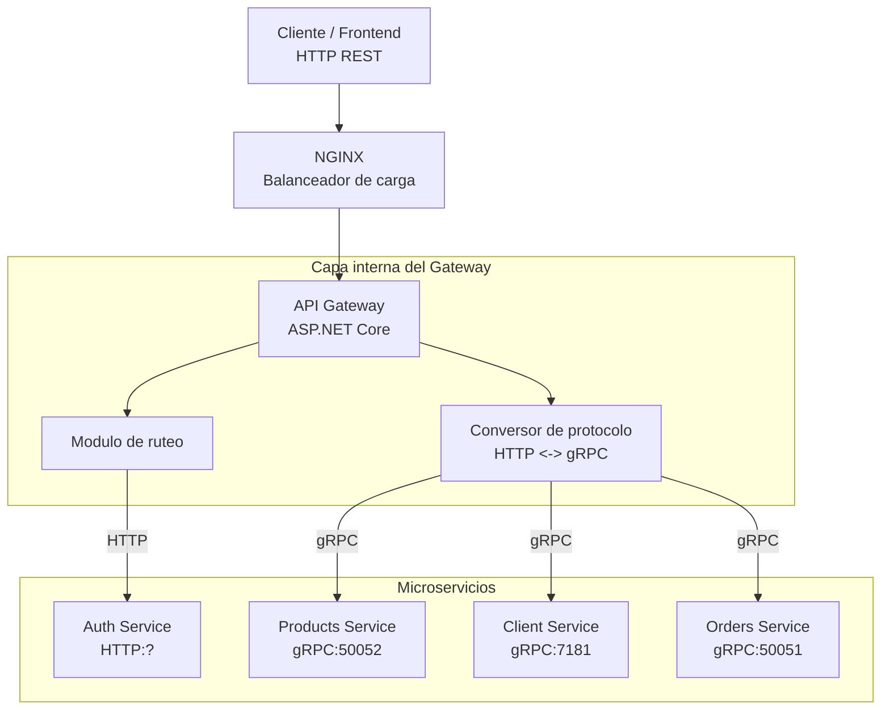

# Censudex - API Gateway

Servicio encargado de recibir todas las solicitudes de los usuarios y distribuirlas correctamente hacia los microservicios de Censudex. Funciona como un punto de control que aplica autenticación, dirige las peticiones al servicio adecuado y optimiza la comunicación mediante balanceo y conversión de protocolos.

## Arquitectura y Patrón de Diseño

### Arquitectura del Sistema: Gateway Unificado con Balanceo de Carga

El API Gateway combina los patrones de agregación y enrutamiento, permitiendo centralizar las solicitudes y dirigirlas correctamente a los microservicios necesarios mientras simplifica la interacción para los clientes.



### Patrones de diseño utilizados:

1. **Patrón de Agregación del Gateway:** Combina varias llamadas a microservicios en una única petición desde el cliente.
2. **Gateway Offloading Pattern:** Desplaza tareas como autenticación y autorización al gateway para liberar carga de los servicios internos.
3. **Patrón de Enrutamiento del Gateway:** Dirige cada solicitud hacia el microservicio correspondiente según su finalidad.
4. **Load Balancing Pattern:** Reparte las solicitudes entre múltiples instancias mediante NGINX para mejorar disponibilidad y rendimiento.

## Tecnologías Utilizadas

- **Framework:** ASP.NET Core 9.0
- **Balanceador:** NGINX
- **Protocolos:**
  - **HTTP/REST:** Para comunicación con servicios externos y Auth Service.
  - **gRPC:** Para comunicación interna entre microservicios
- **Seguridad:** Autenticación con JWT
- **Clientes de comunicación:** Grpc.Net.Client y HttpClientFactory
- **Versionamiento:** Git siguiendo Conventional Commits

## Funciones Principales del API Gateway

### 1. Redirección de Peticiones

Se encarga de enviar cada solicitud al microservicio adecuado según el endpoint solicitado.

### 2. Conversión de Protocolos

- **Cliente → Gateway:** Usa HTTP/REST
- **Gateway → Servicios Internos:** Utiliza gRPC
- **Gateway → Cliente:** Devuelve respuestas HTTP/REST
- Transforma peticiones REST en llamadas gRPC.
- Adapta las respuestas gRPC en JSON para el cliente.

### 3. Gestión Centralizada de Seguridad

- Verifica los tokens JWT antes de permitir acceso a rutas protegidas.
- Consulta al Auth Service para validar credenciales.
- Controla los roles y permisos (cliente / administrador).
- Garantiza que solo usuarios autorizados puedan acceder a los recursos.

### 4. Balanceo de Carga con NGINX

- Reparte las solicitudes entre distintas instancias del gateway.
- Realiza comprobaciones de salud de cada instancia.
- Redirige tráfico a otras instancias si una falla.
- Emplea la estrategia Least Connections para distribuir la carga.

### 5. Manejo Robusto de Errores

- Respuestas HTTP estandarizadas
- Usa correctamente los códigos HTTP (200, 400, 401, 403, 404, 500).

## Endpoints del Gateway

### Autenticación (HTTP → Auth Service HTTP)

| Método | Endpoint                   | Destino      | Descripción             | Autenticación |
| ------ | -------------------------- | ------------ | ----------------------- | ------------- |
| `POST` | `/api/auth/login`          | Auth Service | Iniciar sesión          | No            |
| `GET`  | `/api/auth/validate-token` | Auth Service | Validar token (interno) | No            |
| `POST` | `/api/auth/logout`         | Auth Service | Cerrar sesión           | Sí            |

### Productos (HTTP → Products Service gRPC)

| Método   | Endpoint            | Destino         | Descripción              | Autenticación |
| -------- | ------------------- | --------------- | ------------------------ | ------------- |
| `POST`   | `/api/products`     | Product Service | Crear producto           | Sí (Admin)    |
| `GET`    | `/api/product`      | Product Service | Listar productos         | No            |
| `GET`    | `/api/product/{id}` | Product Service | Obtener producto por ID  | No            |
| `PATCH`  | `/api/product/{id}` | Product Service | Actualizar producto      | Sí (Admin)    |
| `DELETE` | `/api/product/{id}` | Product Service | Eliminar producto (soft) | Sí (Admin)    |

### Clients (HTTP → Clients Service gRPC)

| Método | Endpoint       | Destino        | Descripción   | Autenticación |
| ------ | -------------- | -------------- | ------------- | ------------- |
| `POST` | `/api/clients` | Client Service | Crear usuario | Sí (Admin)    |

### Pedidos (HTTP → Orders Service gRPC)

| Método  | Endpoint                                | Destino        | Descripción                 | Autenticación   |
| ------- | --------------------------------------- | -------------- | --------------------------- | --------------- |
| `POST`  | `/api/order/createOrder`                | Order Service  | Crear pedido                | Sí(Ambos roles) |
| `GET`   | `/api/order/checkOrderStatus{orderId}`  | Orders Service | Obtener estado del pedido   | Sí(Ambos roles) |
| `PATCH` | `/api/order/updateOrderStatus{orderId}` | Order Service  | Actualizar estado de pedido | Sí (Admin)      |
| `PATCH` | `/api/order/cancelOrder{orderId}`       | Order Service  | Cancelar pedido             | Sí(Ambos roles) |
| `GET`   | `/api/order/getOrders`                  | Order Service  | Listar pedidos              | Sí(Ambos roles) |

## Instalación y Configuración

### Requisitos Previos

- **.NET 9 SDK**: [Download](https://dotnet.microsoft.com/download/dotnet/9.0)
- **Docker Desktop**: [Download](https://www.docker.com/products/docker-desktop)
- **VS Code**: [Download](https://code.visualstudio.com/)
- **Todos los microservicios deben estar corriendo**:
  - Auth Service (puerto ?)
  - Products Service (puerto 50052)
  - Clients Service (puerto 7181)
  - Orders Service (puerto 50051)

### 1. Clonar el Repositorio

```bash
git clone https://github.com/carlos44440/censudex-api-gateway.git

cd api-gateway
```

### 2. Configurar Variables de Entorno

Crea un archivo `.env` en la raíz del proyecto:

```env
# Microservices URLs (gRPC)
ORDER_SERVICE_URL=http://localhost:50051
PRODUCT_SERVICE_URL=http://localhost:50052
CLIENT_SERVICE_URL=https://localhost:7181

# JWT Configuration
JWT_SECRET=my-super-secret-key-at-least-32-characters-long-for-jwt-validation!
JWT_ISSUER=CensudexAPIGateway
JWT_AUDIENCE=CensudexClients
JWT_EXPIRATION_MINUTES=60

# Auth Service URL (HTTP)
AUTH_SERVICE_URL=http://localhost:?
```

### 3. Instalar Dependencias

```bash
dotnet restore
```

### 4. Compilar el Proyecto

```bash
dotnet build
```

### 5. Crear la instancia de NGINX

```bash
docker-compose up --build
```

### 7. Ejecutar el Proyecto

**Modo Desarrollo (sin Docker):**

```bash
dotnet run # Instancia del gateway

dotnet run --urls "http://localhost:7001" # Instancia del gateway
dotnet run --urls "http://localhost:7002" # Instancia del gateway
dotnet run --urls "http://localhost:7003" # Instancia del gateway
```

El API Gateway estará disponible en:

- **HTTP:** http://localhost:5234
- **Postman:** http://localhost/api/...

## Ejemplos de Uso

### Authservice Endpoints

### 1. Login (POST /api/login)

**Request Body:**

```json
{}
```

**Response (200):**

```json
{}
```

### 2. Validar Token (GET /api/?)

**Request Body:**

```json
{}
```

**Response (200):**

```json
{}
```

### 3. Logout (POST /api/logout)

**Request Body:**

```json
{}
```

**Response (200):**

```json
{}
```

### Products Service Endpoints

#### 1. Crear Producto (POST /api/products)

**Request Body**

```bash

```

**Response (200):**

```json
{}
```

#### 2. Listar Productos (GET /api/products)

**Request Body**

```json
{}
```

**Response (200):**

```json
[]
```

#### 3. Obtener Producto por ID (GET /api/products/{id})

**Request Body**

```json
{}
```

**Response (200):**

```json
{}
```

#### 4. Actualizar Producto (PATCH /api/products/{id})

**Nota:** Solo accesible para administradores.

**Request Body**

```bash

```

**Response (200):**

```json
{}
```

#### 5. Eliminar Producto (DELETE /api/products/{id})

**Request Body**

```json
{}
```

**Response (200):**

```json
{}
```

### Clients Service Endpoints

#### 1. Crear usuario (POST /api/clients)

**Request Body**

```json
{}
```

**Response (200):**

```json
{}
```

#### 2. Consultar clientes por id (GET /api/clients/{productId})

**Request Body**

```json
{}
```

**Response (200):**

```json
{}
```

#### 3. ..

**Request Body**

```json
{}
```

**Response (200):**

```json
{}
```

### Orders Service Endpoints

#### 1. Crear Pedido (POST /api/order)

**Comportamiento por Rol**

- **Cliente & Admin:** Verificar la existencia de los productos -> Obtener los datos de los productos -> Crear pedido -> Verificar si existe stock suficiente (RabbitMq) -> Enviar correo de confirmacion.

**Request Body:**

```json
{
  "items": [
    {
      "productId": "019a3bb0-158d-795f-978f-cbef1a81fdc1",
      "quantity": 10
    },
    {
      "productId": "019a3bb0-158d-795f-978f-cbef1a81fdc4",
      "quantity": 12
    }
  ]
}
```

**Response (200):**

```json
{
  "items": [
    {
      "productId": "019a3bb0-158d-795f-978f-cbef1a81fdc1",
      "productName": "Product",
      "quantity": 10,
      "unitPrice": 12,
      "subTotal": 120
    },
    {
      "productId": "019a3bb0-158d-795f-978f-cbef1a81fdc4",
      "productName": "Product",
      "quantity": 12,
      "unitPrice": 12,
      "subTotal": 144
    }
  ],
  "id": "5fa571dc-4b93-4ccf-acb5-f1f294d2863e",
  "orderDate": "2025-11-13T23:26:19.9852331Z",
  "userId": "b8f16a9b-ef59-41e2-8e8f-3db1f14d0e39",
  "status": "pendiente",
  "totalAmount": 264,
  "trackingNumber": "TRK-20251113-659224",
  "deliveryDate": "2025-12-13T23:26:19.9952543Z",
  "cancellationReason": ""
}
```

#### 2. Consultar estado del pedido (GET /api/order/checkOrderStatus/{orderId})

**Comportamiento por Rol**

- **Cliente & Admin:** Verificar que la id del pedido corresponda con sus pedidos creados -> Enviar el estado del pedido.

**Response (200):**

```json
cancelado
```

#### 3. Actualizar estado del pedido (PUT /api/order/updateOrderStatus/{orderId})

**Comportamiento por Rol**

- **Admin:** Actualizar estado del pedido -> Obtiene los datos del cliente -> Envia correo de confirmacion al cliente (Personalizado segun el estado actualizado).

**Request Body:**

```json
{
  "status": "en procesamiento"
}
```

**Response (200):**

```json
{
{
    "id": "73cd22f2-d5bd-48e4-a998-e31d3e044a92",
    "orderDate": "2025-11-16T04:44:50.2630120",
    "userId": "019a8ac6-79d4-7f5d-a537-bf2ec6d0ff7c",
    "items": [],
    "status": "en procesamiento",
    "totalAmount": 8990,
    "trackingNumber": "TRK-20251116-146349",
    "deliveryDate": "2025-12-16T04:44:50.2715430",
    "cancellationReason": ""
}
}
```

#### 4. Cancelar pedido (PUT /api/order/cancelOrder/{orderId})

**Comportamiento por Rol**

- **Admin:** Cancela el pedido -> Obtiene los datos del cliente -> Obtiene productos para recomendacion (Caso: fallo por stock)
  -> Envia correo de confirmacion al cliente.
- **Cliente:** Cancela el pedido -> Envia correo de confirmacion.

**Request Body:**

```json
{
  "cancellationReason": "Mala gestion"
}
```

**Response (200):**

```json
{
  "id": "20f30f5f-b4de-4c2f-9ab1-d8419caceb47",
  "orderDate": "2025-11-16T05:55:28.8661950",
  "userId": "019a8ac6-79d4-7f5d-a537-bf2ec6d0ff7c",
  "items": [],
  "status": "cancelado",
  "totalAmount": 8990,
  "trackingNumber": "TRK-20251116-463073",
  "deliveryDate": "2025-12-16T05:55:28.8662240",
  "cancellationReason": "Mal gestion"
}
```

#### 5. Listar Pedidos (GET /api/order/getOrders?Filtros)

**Comportamiento por Rol**

- **Admin:** Obtiene los pedidos de todos los usuarios.
- **Cliente:** Obtiene solo los pedidos que ha creado.

**Response (200):**

```json
{
  "orderDto": [
    {
      "items": [
        {
          "productId": "019a3bb0-15b6-74f7-b877-2a3d05587047",
          "productName": "Product",
          "quantity": 21,
          "unitPrice": 12,
          "subTotal": 252
        },
        {
          "productId": "019a3bb0-15b6-7455-97d2-1eae07639b58",
          "productName": "Product",
          "quantity": 2111,
          "unitPrice": 12,
          "subTotal": 25332
        },
        {
          "productId": "019a3bb0-158d-795f-978f-cbef1a81fdc6",
          "productName": "Product",
          "quantity": 1222,
          "unitPrice": 12,
          "subTotal": 14664
        }
      ],
      "id": "557fe6b4-2f03-447a-b98d-4fdac50c7b49",
      "orderDate": "2025-11-12T20:10:49.2969680",
      "userId": "b8f16a9b-ef59-41e2-8e8f-3db1f14d0e39",
      "status": "cancelado",
      "totalAmount": 40248,
      "trackingNumber": "TRK-20251112-221854",
      "deliveryDate": "2025-12-12T20:10:49.3161600",
      "cancellationReason": "Insufficient stock for one or more products"
    }
  ]
}
```
